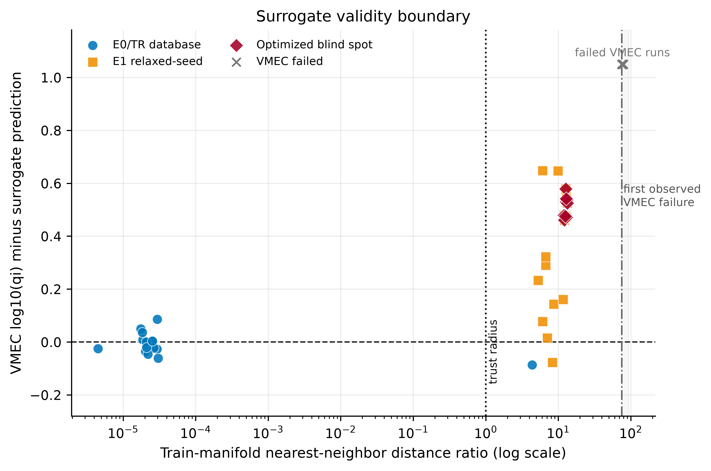
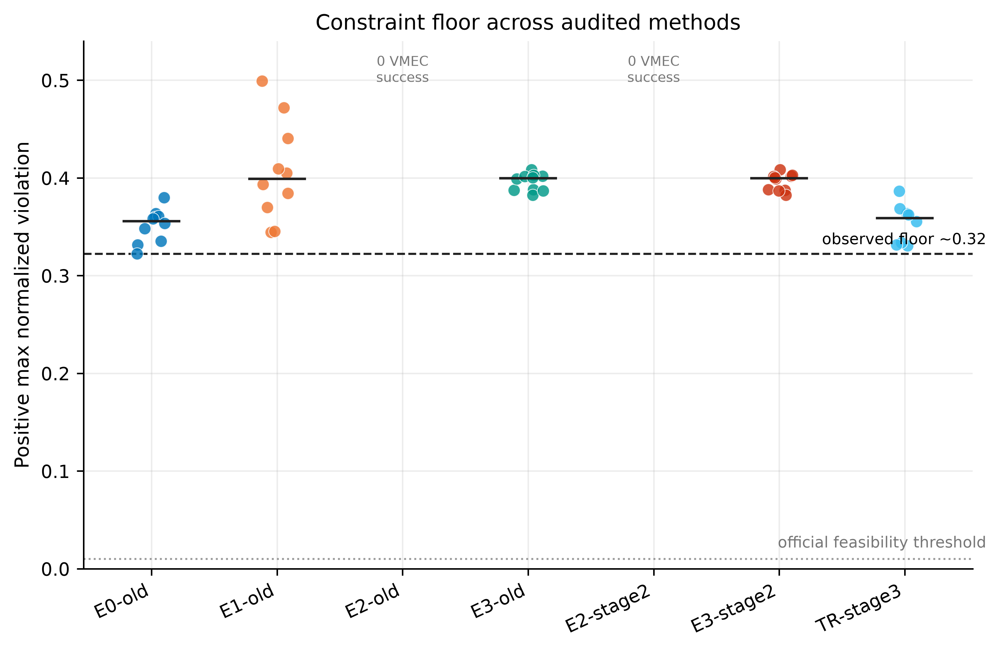
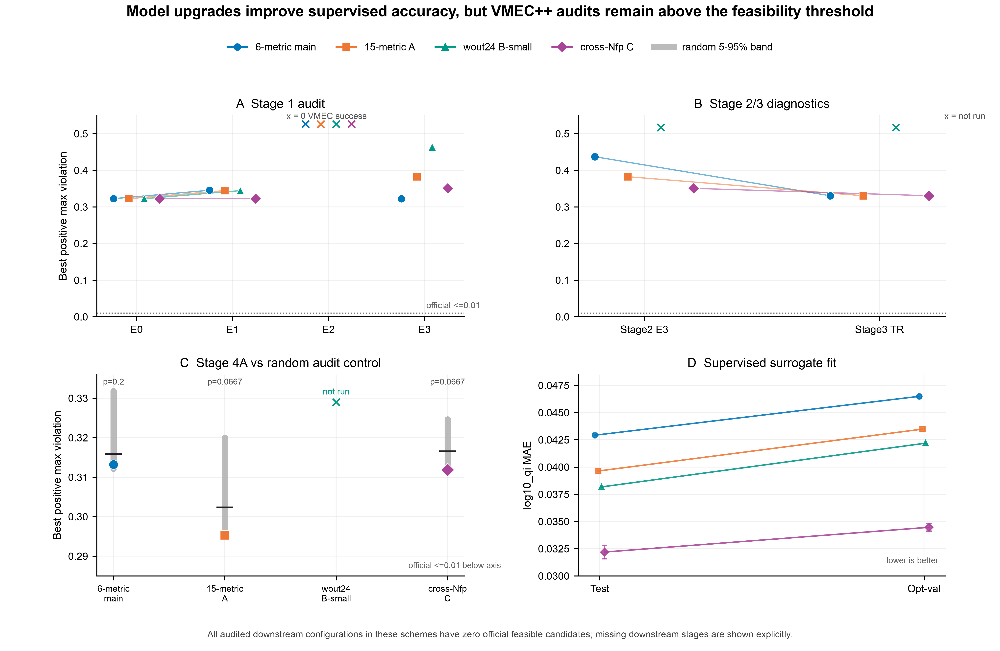

# 面向 ConStellaration Problem 2 的离线代理引导搜索

**作者：Shengnian Liu**

[English](README.md) | [中文](README_zh.md)

本仓库研究 **ConStellaration Problem 2** 上的**离线代理辅助优化**：在 VMEC++
高保真评价昂贵的条件下，如何利用公开数据训练代理、生成边界候选，并用固定预算
做官方审计。公开发布包括方法学、可执行实验流水线与配置、中文技术报告、交互式
HTML 汇报，以及 3 张最终图。

## 工作总览

### 问题是什么

Problem 2 是一个约 **80 维带约束黑盒优化**问题。设计变量为 stellarator 对称的
Fourier 边界系数（`Nfp=3`、低阶模式）。目标是最大化线圈可制造性指标 `L_∇B`。
官方可行性要求五组约束同时成立（环径比、旋转变换、QI 残差 `log10(qi)`、磁镜比、
拉长比）。**全部约束通过**时官方得分为 `L_∇B / 20`，否则得分为 **0**。

VMEC++ 平衡求解成本过高，不宜直接嵌入大规模自由搜索内环。官方 Hugging Face 数据
集提供了大量 QI-like 样本，但本项目所用的 **Nfp=3 无错误子集（68,191 条）中，
同时满足全部严格 Problem 2 约束的样本数为 0**。因此训练支持里的可行域极稀疏；
模型学到的“可行性”至多是对连续违反量的插值或外推，因为该子集中并无真正可行的平衡样本可供学习。

### 项目目标

构建一条完整的**离线**闭环：

```text
官方数据
  -> 确定性过滤与划分
  -> 多任务代理集成训练
  -> 仅代理参与的候选搜索
  -> 固定预算 VMEC++ / 官方审计
  -> 预测与物理量对照诊断
```

硬协议：在同一次离线运行中，VMEC++ 与官方正演**不进入**训练、模型选择、搜索
目标与重排序；物理评价只作为预定的搜索后审计。

### 做了什么

| 层级 | 内容 |
|---|---|
| **核心模型** | 以 Fourier 系数为输入的谱感知多任务深度集成 MLP |
| **搜索工具** | 代理上的 CMA-ES / NGOpt；松弛种子附近 PCA–GMM；信任域；代理 ALM 式预筛 |
| **主线阶段** | Stage 1 的 E0–E3 → Stage 2 潜空间 → Stage 3 信任域 → Stage 4A 预筛 + 随机对照 |
| **模型升级** | 方案 A（15 指标）、B-small（wout24 辅助头）、C（跨 Nfp 预训练 → Nfp=3 微调） |
| **诊断** | 距离–偏差曲线、约束违反地板、VMEC 成功率、随机预筛分位数 |
| **对外材料** | 中文报告、HTML 汇报、3 张最终图 |

### 主要结论（有范围限定）

在上述离线协议与所用 Nfp=3 子集下：

1. **分布内学习有效。** 代理对 Problem 2 指标与连续违反量在同源划分上拟合良好。
2. **优化压力下出现两类失效。** 无约束代理搜索易**利用乐观误差**（代理分高、
   审计差）；过硬的信任域则**塌缩回数据库邻域**，难以跨过官方可行线。
3. **Stage 4A 中，代理 ALM 式预筛在匹配预算下未稳定优于随机送审对照。**
   候选池构造可能有小幅帮助，但排序增益不能单独归因于代理。
4. **表示升级改善监督，不自动带来可行性。** 15 指标、wout 中间监督、跨 Nfp
   预训练可改善预测（有时改善 VMEC 可运行性），但报告协议下审计仍为 **0 个
   官方可行候选**。
5. **主要产出是关于离线代理可靠性的方法学诊断证据。** 跨越可行线更可能需要
   可行侧或近可行侧高保真标签（混合主动学习）。

具体数值、消融与措辞边界见中文技术报告。

## 方法概览

### 离线协议

仅当 VMEC++ 不用于训练、超参选择、CMA-ES/NGOpt 目标、惩罚调参与重排序时，
才称为离线运行。搜索结束后用**固定 attempted 审计预算**评价入选候选；失败
计入分母。审计标签不得回流到同一次离线运行。

### 代理模型

- **输入：** 固定 `(m,n)` 顺序的自由 Fourier 边界系数，按训练集标准化。
- **输出头（随赛道）：** Problem 2 的 6 个物理指标；连续
  `max_normalized_violation`；可选更多 default 指标（15 指标方案）；可选 24 维
  wout 派生辅助标签（仅训练）。
- **结构：** 残差 MLP 集成（4 成员）、多任务回归、成员分歧作不确定性。
- **为何用连续违反量：** 官方可行正例为 0 时，二分类可行性会塌缩。连续违反量
  回归利用现有标签提供可用的排序信号。
- **wout 规则：** wout 量只作**训练标签**。若推理也依赖 wout，则须先跑 VMEC++，
  失去加速意义。

### 候选生成（Stage 1：E0–E3）

| 编号 | 思路 |
|---|---|
| **E0** | 数据库静态排序（无模型搜索） |
| **E1** | 在 **relaxed55** 种子附近局部生成（PCA + GMM + 代理排序） |
| **E2** | 纯代理 CMA-ES / 高目标搜索 |
| **E3** | 保守搜索：目标 + 违反量、不确定性与支撑惩罚 |

**relaxed55** 是按论文风格**放宽阈值**得到的近可行种子。它们未达到官方可行
标准，也不进入任何监督 train/val/test，仅作生成先验。

### 阶段递进

| 阶段 | 回答的问题 |
|---|---|
| **1** | 固定 top-K VMEC 预算下，代理与基础搜索能否产出可审计候选？ |
| **2** | 潜空间/几何约束搜索能否相对盲目代理搜索提升 VMEC 成功率？ |
| **3** | 瓶颈是几何、代理乐观，还是数据支撑？信任域诊断。 |
| **4A** | 代理 ALM/NGOpt 式搜索作预筛时，是否优于同池随机送审？ |

### 6 指标主线之外的模型方案

| 方案 | 改动 | 作用 |
|---|---|---|
| **A – 15 指标** | 额外 default 物理标签多任务；评分仍读 Problem 2 指标 | 加强监督表示 |
| **B-small – wout24** | 自平衡 wout 提取 24 维中间物理头 | 仅辅助训练 |
| **C – cross-Nfp** | 非 Nfp=3 预训练，再在 Nfp=3 微调 | 迁移初始化 |

### 优化器与诊断（简述）

- **CMA-ES / NGOpt：** 无导数连续优化器，查询代理得分。
- **PCA / GMM：** 把候选约束在数据支撑几何与松弛种子附近。
- **信任域：** 集成不确定性 + 训练/种子距离 + 谱合法性。
- **surrogate arbitrage：** 优化器挖掘训练边界处的系统性乐观误差——需测量，
  不可默认。

## 报告、汇报与图

- 中文技术报告：
  [`presentations/advisor_report/report_cn.md`](presentations/advisor_report/report_cn.md)
- 交互式 HTML 汇报：
  [`presentations/advisor_report/advisor_report_deck.html`](presentations/advisor_report/advisor_report_deck.html)

用浏览器直接打开 HTML，方向键翻页。

### 最终图







## 与 ConStellaration 及官方排行榜的关系

本仓库建立在官方 ConStellaration 生态之上。

| 资源 | 本项目中的角色 |
|---|---|
| [数据集](https://huggingface.co/datasets/proxima-fusion/constellaration) | 离线训练与诊断（公开低阶 QI-like 边界） |
| [代码 / 正演](https://github.com/proximafusion/constellaration) | 问题定义、评分、审计接口 |
| [设计排行榜](https://huggingface.co/spaces/proxima-fusion/constellaration-bench) | 公开展示已审计的最终边界与得分 |
| [公开结果文件](https://huggingface.co/datasets/proxima-fusion/constellaration-bench-results) | 提交边界的 `boundary_json` |
| 论文 ALM-NGOpt 基线 | 论文低阶设定下的在线物理优化参考 |

### Fourier 维度：两条评价赛道

官方数据集与论文 Problem 2 基线使用 **低阶** stellarator 对称 Fourier 边界，
极向/环向截断为 `m,n ≤ 4`，自由设计维数约 **80**。本仓库主线的代理训练、
E0–E3 搜索、Stage 2–4A 以及方案 A/B/C 均在该 **官方空间（official-space）**
上进行。

公开排行榜结果库中，`simple_to_build`（Problem 2）的多条**高分**最终边界使用
**扩展** Fourier 数组：

| 观测到的 `r_cos` / `z_sin` 形状 | 模式截断（约） | 在公开榜上的角色 |
|---|---|---|
| `(5, 9)` | `m,n ≤ 4` | 与公开数据集、本仓库主线同一低阶类别 |
| `(8, 15)` | `m,n ≤ 7` | 扩展空间提交；多条较强得分 |
| `(11, 21)` | `m,n ≤ 10` | 更高扩展空间；亦见于高分段 |

测量来源：`proxima-fusion/constellaration-bench-results` 公开行（2026-07 抽样）。
例如，该样本中 `simple_to_build` 靠前得分多落在 `(8,15)` 或 `(11,21)`；低阶
`(5,9)` 亦有可行得分，但排名通常更低。官方评价器在边界为合法 Fourier 曲面时
接受扩展模式；这与公开约 80 维训练语料是**不同的设计空间**。

### 本项目与排行榜的相对位置

- 官方评价仍是得分权威。代理输出为预测量；VMEC++ / 正演输出为审计物理量。
- 排行榜行公布**最终审计边界与得分**。搜索过程与 VMEC++ 调用次数不随这些行
  一并公开。
- 论文 ALM-NGOpt 在论文低阶 Fourier 设定下，以**在线**物理优化报告可行
  Problem 2 得分，算力预算较大。
- 本仓库研究的是：在**公开低阶 Nfp=3 数据**上的**固定预算离线代理搜索**。
  有效性边界、约束地板、随机预筛对照等诊断均针对该赛道。
- 扩展模式榜单实践是**独立赛道**：高模最终边界不并入本仓库官方空间的方法
  对比。若要对齐扩展空间榜单得分，需要单独的扩展空间实验设计。

**排行榜问题：** 在已提交且经官方审计的边界中，谁的官方得分最高？  
**本仓库问题：** 仅在公开低阶数据与固定离线审计预算下，代理流水线能学到什么、
在何处失败？

## 仓库目录

```text
.
├── experiments/
│   ├── official_space/
│   │   ├── stage1_base/                # 基础 6/15 指标流水线（E0–E3）
│   │   ├── stage2_latent/              # 潜空间可行性搜索
│   │   ├── stage3_trust_region/        # 套利 / 信任域诊断
│   │   └── stage4_alm_prescreen/       # 代理 ALM/NGOpt 预筛 + 对照
│   ├── auxiliary_supervision/wout24/   # 方案 B-small
│   ├── transfer/cross_nfp/
│   │   ├── pretrain/                   # 方案 C 预训练 / 微调
│   │   └── downstream/                 # 使用跨 Nfp 代理的 Stage 1–4
│   ├── hf_config_screening/
│   └── wout_download_estimate/
├── presentations/advisor_report/
├── figures/
├── docs/                               # 方法学、脚本目录、引用
├── tests/
├── requirements.txt
├── CITATION.cff
└── LICENSE
```

`outputs*` 通过 `.gitignore` 仅保留本地。脚本职责见
[`docs/SCRIPT_CATALOG.md`](docs/SCRIPT_CATALOG.md)；目录说明见
[`docs/REPOSITORY_LAYOUT.md`](docs/REPOSITORY_LAYOUT.md)；方法细节见
[`docs/METHODOLOGY.md`](docs/METHODOLOGY.md)。

## 环境安装

主实验环境对应 **Python 3.10**。

```bash
python3.10 -m venv .venv
source .venv/bin/activate
python -m pip install --upgrade pip
python -m pip install -r requirements.txt
```

`requirements.txt` 固定实验所用 ConStellaration 提交。GPU 环境请先安装匹配
CUDA 的 PyTorch，再装其余依赖。

## 数据获取

```python
from datasets import load_dataset

dataset = load_dataset(
    "proxima-fusion/constellaration",
    "default",
    split="train",
)
```

缓存、Parquet 切分、wout、权重、候选与逐行审计均保留本地，不随本仓库发布。

wout24 需显式提供本地分片目录：

```bash
python experiments/auxiliary_supervision/wout24/01_build_wout24_labels.py \
  --filtered-parts-dir /path/to/filtered/wout/parquet/parts
```

## 如何运行（基础流水线）

```bash
cd experiments/official_space/stage1_base
python 00_check_environment.py --config configs/quick.yaml
python 01_prepare_dataset.py --config configs/quick.yaml
python 02_train_surrogate.py --config configs/quick.yaml
python 03_generate_relaxed_seed_candidates.py --config configs/quick.yaml
python 04_run_conservative_cmaes.py --config configs/quick.yaml
python 05_vmec_audit_candidates.py --config configs/quick.yaml
python 06_analyze_results.py --config configs/quick.yaml
```

后续阶段消费前序本地输出。完整脚本地图见
[`docs/SCRIPT_CATALOG.md`](docs/SCRIPT_CATALOG.md)。

## 方法学赛道（目录对应）

- **官方空间：** 低阶 Fourier 基准空间与对齐的审计预算。
- **潜空间 / 信任域：** PCA 支撑、距离、不确定性、谱检查。
- **辅助监督：** 额外指标与 wout 派生训练标签。
- **跨 Nfp 迁移：** 非目标周期预训练，Nfp=3 微调。
- **稀疏反馈扩展（未来混合）：** 分批 VMEC 审计 + 重训。

## 未来方向

1. 混合主动学习：代理提议、VMEC 审计、回填重训；绘最优官方得分对累积物理
   调用曲线。
2. 获取可行侧 / 近可行侧高保真标签。
3. 将中间物理量用作排序**过滤**；推理输入仍为 Fourier 系数，评分仍读
   Problem 2 指标。
4. 更广迁移须对齐 Problem 2 vacuum 定义与官方评分。
5. 边界表征研究（近轴、学习潜变量、谱带）留作本发布之后的独立工作。
6. 工程：共享包、单元测试（特征顺序、约束归一化、boundary round-trip、审计
   预算）、干净环境 smoke run。

详见报告第七部分与 [`docs/METHODOLOGY.md`](docs/METHODOLOGY.md)。

## 复现规则

1. 记录上游 ConStellaration 提交号与环境版本。
2. 保持划分确定性；松弛种子不进入监督训练。
3. 每次离线运行中，VMEC++ 审计标签不得参与模型选择。
4. 统计每一个 attempted 审计槽位，包括求解失败。
5. 代理预测与官方物理分字段报告。
6. 在同一 Fourier 空间与同一审计预算下比较方法。
7. 扩展 Fourier 参数化作为独立赛道单独报告。

## 引用

见 [`CITATION.cff`](CITATION.cff)。基准与 VMEC++ BibTeX：
[`docs/REFERENCES.md`](docs/REFERENCES.md)。上游归属：
[`THIRD_PARTY_NOTICES.md`](THIRD_PARTY_NOTICES.md)。

## 许可证

Copyright © 2026 Shengnian Liu。原创代码、文档、报告、HTML 汇报与最终图采用
MIT License。上游软件与数据集保留其原始条款。详见
[`LICENSE_SCOPE.md`](LICENSE_SCOPE.md)。
